# Glasso E-commerce - Frontend

Canlı demo için: [Glasso](https://glasso.netlify.app/)

Bu proje, gözlük satış işlemlerini gerçekleştirmek amacıyla geliştirilmiş bir frontend uygulamasıdır. React.js kullanılarak oluşturulmuş olup, kullanıcı dostu bir arayüz sunar.

## Proje Özellikleri

- **React.js**: Kullanıcı arayüzünü geliştirmek için kullanılan popüler bir JavaScript kütüphanesi.
- **Redux**: Uygulama durum yönetimi için kullanılır.
- **React Router**: Sayfalar arasında geçiş yapmak için kullanılır.
- **Fetch**: API istekleri yapmak için kullanılır.
- **SCSS**: Stil yazımı için kullanılan bir CSS ön işleme dilidir.

## Kurulum

### Kurulum Adımları

1. Bu repoyu klonlayın:
   ```bash
   git clone https://github.com/keremcankurt/react-glasso-ecommerce.git
   cd react-glasso-ecommerce

2. Gerekli bağımlılıkları yükleyin:
   ```bash
   npm install
3. Uygulamayı başlatın:
   ```bash
   npm start

## Uygulamadan Görüntüler
| Resim | Açıklama |
|-------|----------|
| 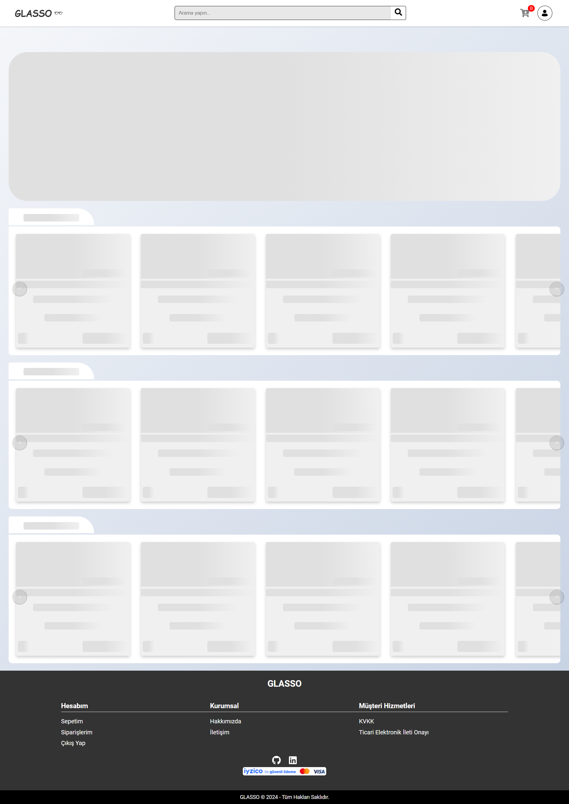 | Açıklama 1 |
| 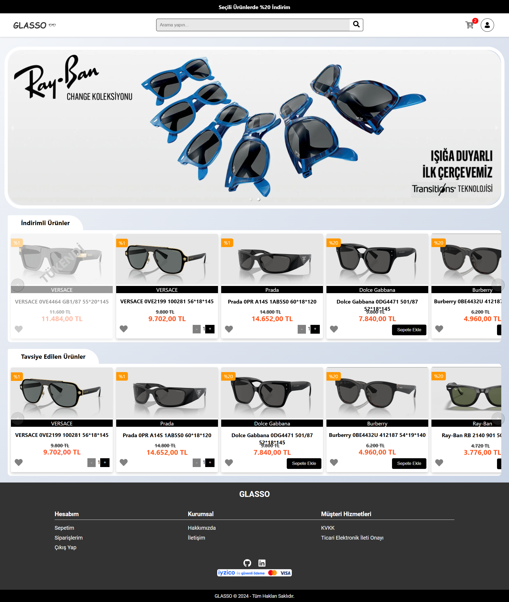 | Açıklama 1 |
| 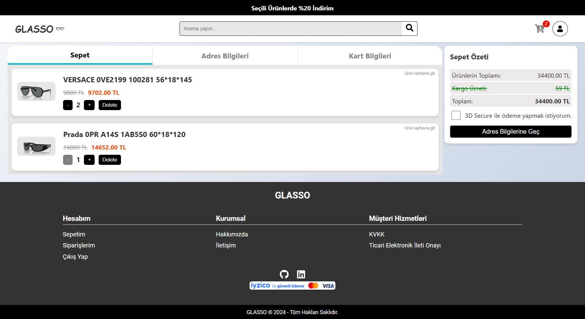 | Açıklama 1 |
| 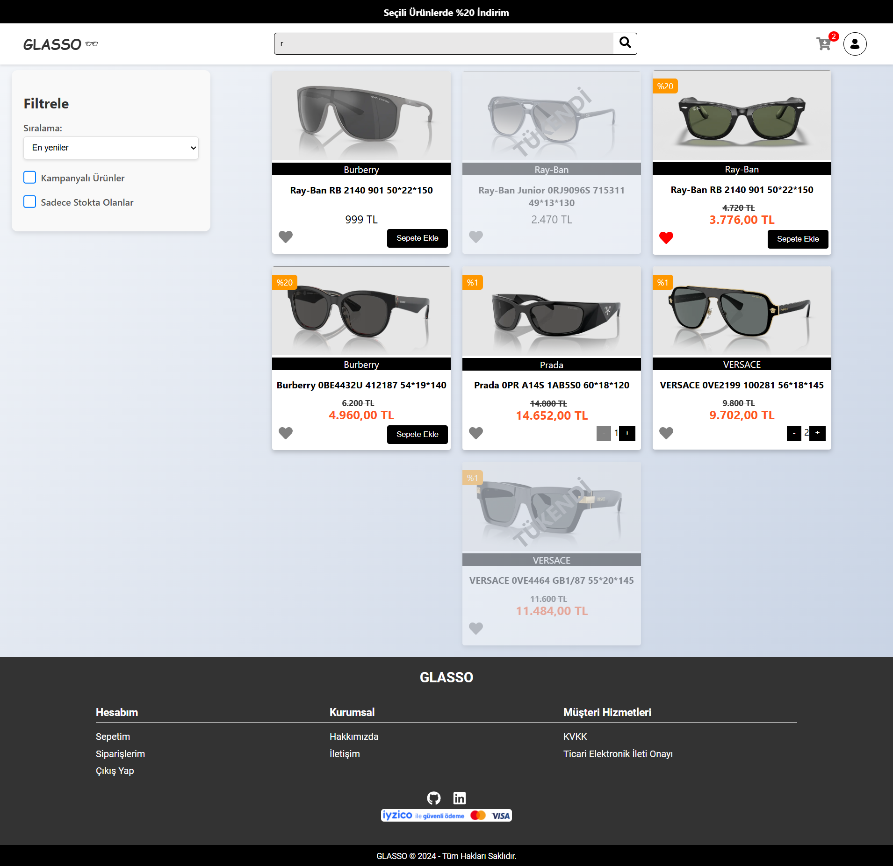 | Açıklama 1 |
| 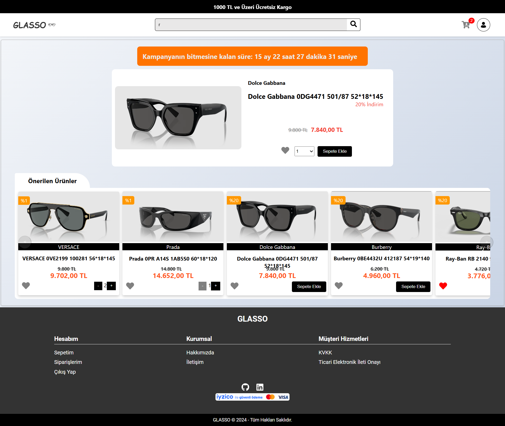 | Açıklama 1 |
|  | Açıklama 1 |
|  | Açıklama 1 |
| 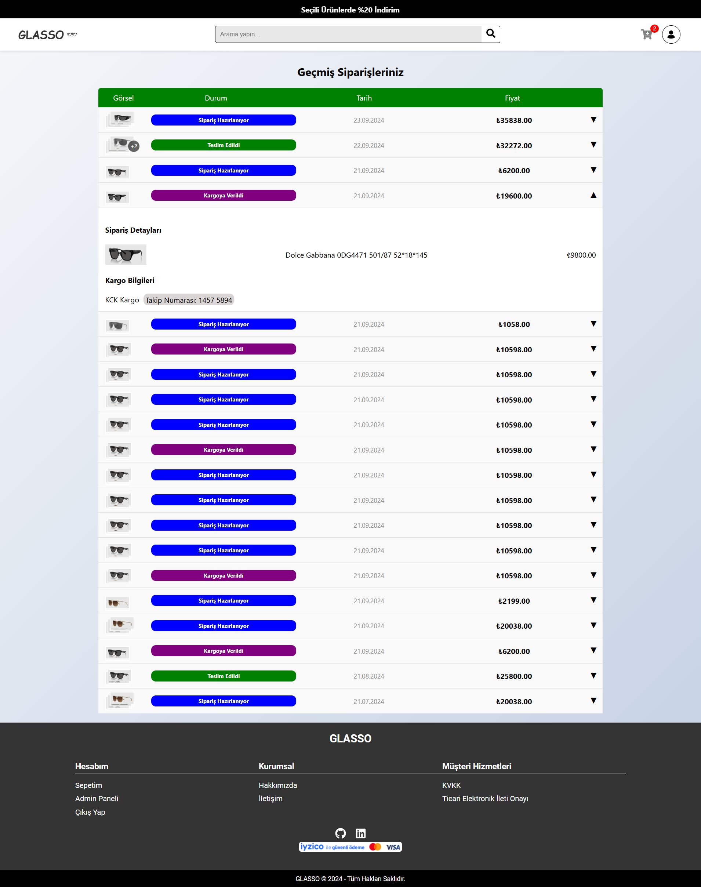 | Açıklama 1 |
| 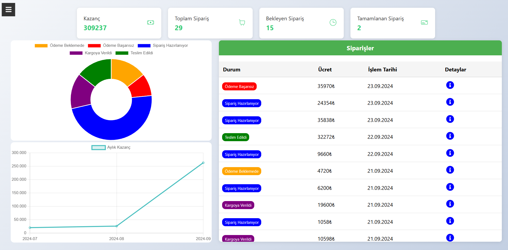 | Açıklama 1 |
| 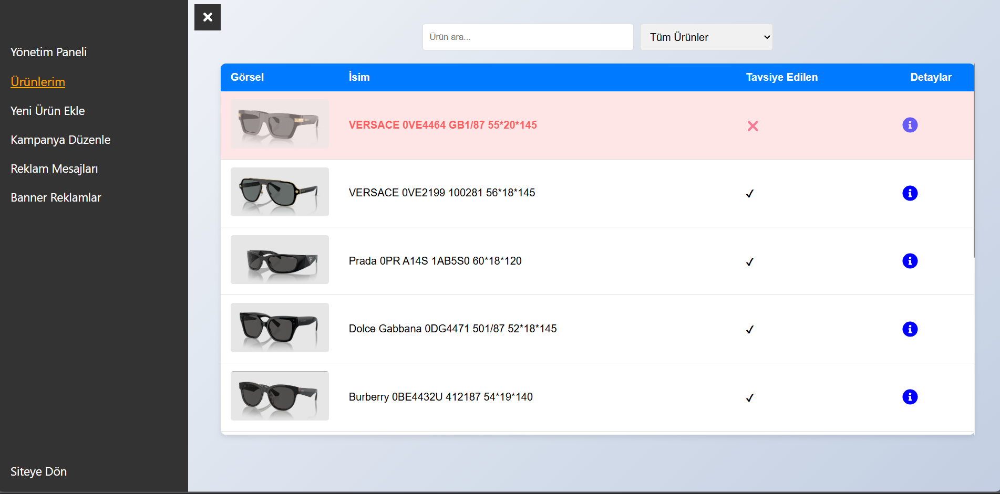 | Açıklama 1 |
| 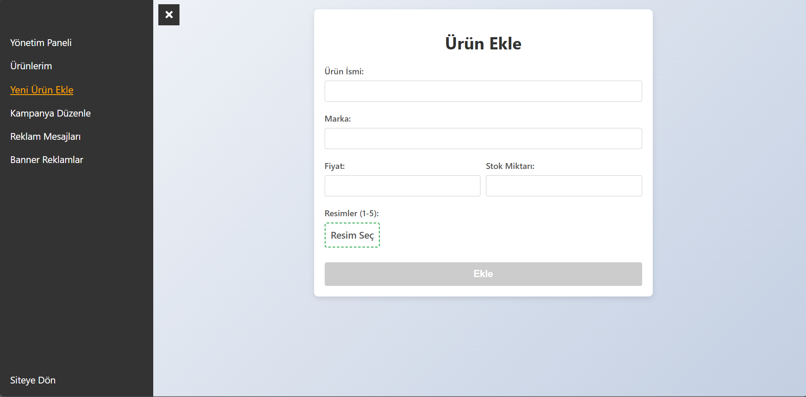 | Açıklama 1 |
| 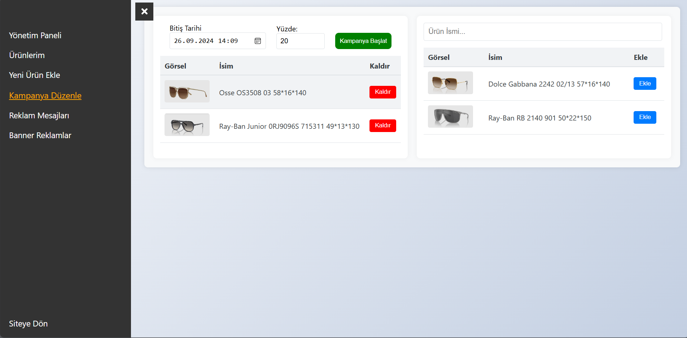 | Açıklama 1 |
| 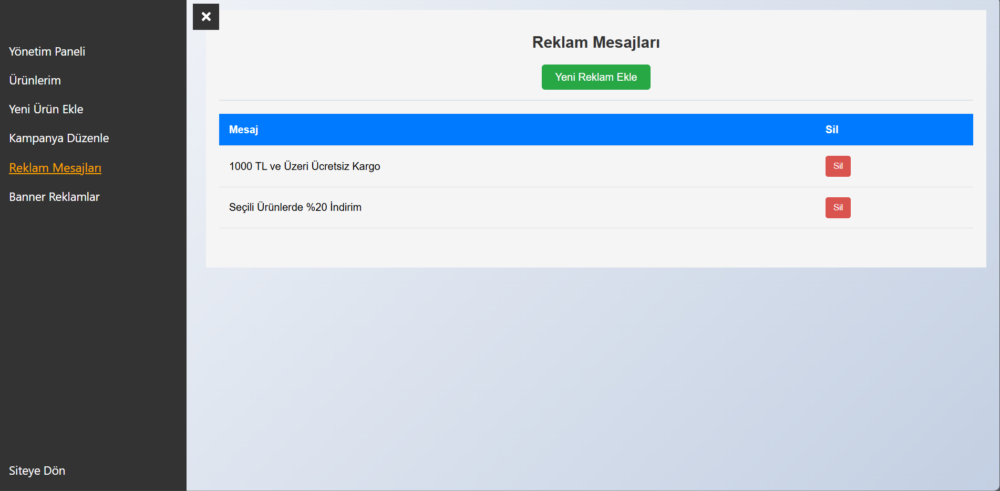 | Açıklama 1 |
| 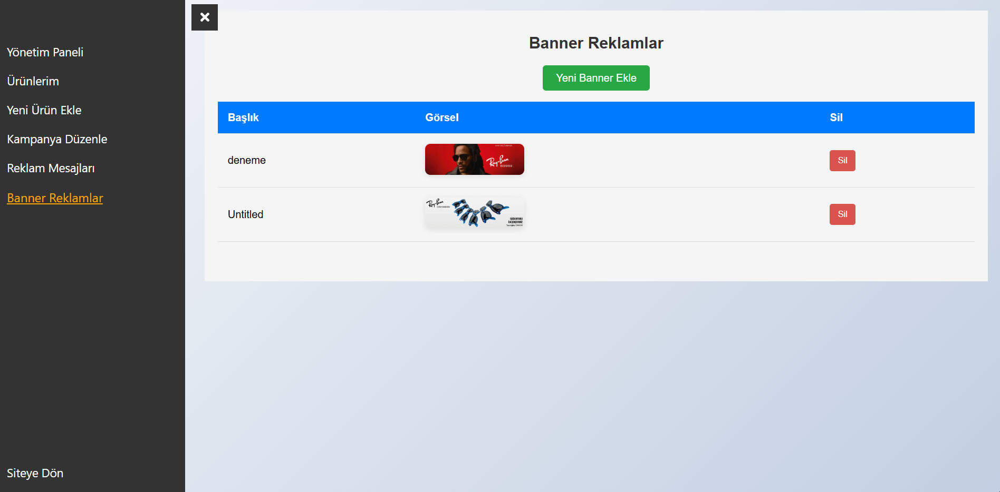 | Açıklama 1 |
